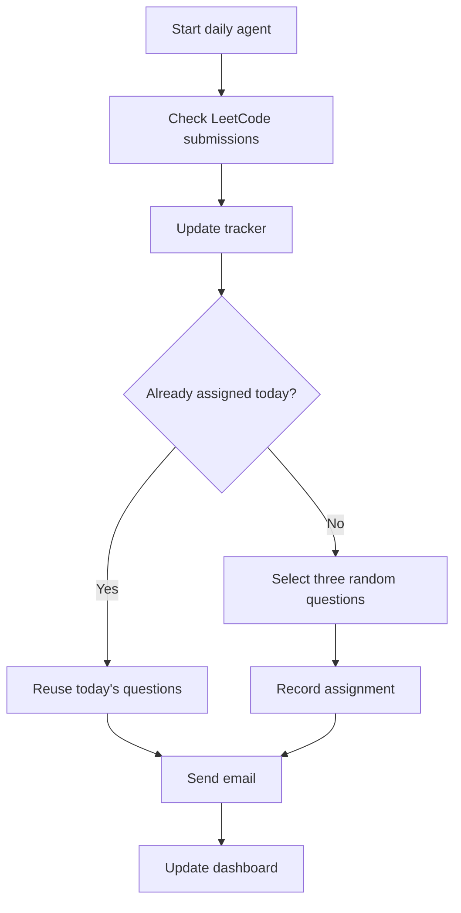

# LeetCode Daily Mastery Agent

An automated coding-practice agent that emails three random LeetCode problems every day, detects accepted submissions, tracks progress, and displays performance in an interactive dashboard.

## Features

- Selects three random questions daily
- Avoids recently assigned and solved problems
- Emails questions through Gmail
- Detects accepted LeetCode submissions automatically
- Tracks pending and completed questions
- Analyzes progress by topic and difficulty
- Provides an interactive Streamlit dashboard
- Uses the America/Los_Angeles timezone

## Workflow



## Project Structure

```text
leetcode-daily-agent/
├── data/
│   ├── questions.json
│   ├── progress.json
│   └── tracker.json
├── src/
│   ├── leetcode_api.py
│   ├── main.py
│   ├── notifier.py
│   ├── progress_tracker.py
│   └── question_selector.py
├── dashboard.py
├── requirements.txt
└── README.md
```

## Setup

Create and activate a virtual environment:

```powershell
py -m venv venv
.\venv\Scripts\Activate.ps1
```

Install dependencies:

```powershell
pip install -r requirements.txt
```

Create a `.env` file:

```env
GMAIL_ADDRESS=your_email@gmail.com
GMAIL_APP_PASSWORD=your_google_app_password
RECIPIENT_EMAIL=your_email@gmail.com
LEETCODE_USERNAME=your_leetcode_username
```

Never upload the `.env` file.

## Run the Agent

```powershell
python -u src\main.py
```

## Run the Dashboard

```powershell
streamlit run dashboard.py
```

Then open `http://localhost:8501`.

## Security

- Gmail credentials remain in `.env`
- `.env` is excluded by `.gitignore`
- No LeetCode password is required
- Only public LeetCode activity is accessed

## Roadmap

- Automated daily GitHub Actions workflow
- Weekly progress-summary email
- Adaptive weak-topic recommendations
- Larger question bank
- Online dashboard deployment

## Author

**Soham Banerjee**

GitHub: [Soham286](https://github.com/Soham286)
